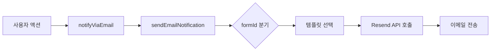

# Resend 이메일 시스템 분석 문서

## 📋 개요

이 폴더는 Resend 서비스를 활용한 이메일 자동화 시스템으로, 반려해변 캠페인 관련 다양한 이메일 알림을 처리합니다.

---

## 📂 폴더 구조

```
resend-email-system/
├── dateUtils.ts                    # 날짜/시간 포맷팅 유틸리티
└── email/
    ├── types.ts                    # 이메일 페이로드 타입 정의
    ├── email-resend-hook.ts        # 메인 이메일 전송 로직
    ├── notifyViaEmail.ts           # 이메일 전송 래퍼 함수
    ├── newsletter-templates.ts     # 뉴스레터 HTML 템플릿 생성기
    ├── templates/                  # React 이메일 템플릿들 (30개)
    ├── utils/                      # PDF 생성 유틸리티
    └── send-volunteer-request-*/   # API 라우트 핸들러
```

---

## 🛠 주요 파일 상세

### 1. `dateUtils.ts` - 날짜 포맷팅 유틸리티

**주요 기능:**

- 한국어 로케일 기반 날짜 포맷팅
- MySQL TIME 문자열 처리
- 상대적 시간 표현 (오늘, 어제, 3일 전 등)

**핵심 함수:**

```typescript
formatDateOrTime(); // 자동 판단 포맷팅
formatKoreanDate(); // 한국식 날짜 (2024년 5월 3일 (금))
formatHM(); // 시:분 형식
formatSmartDate(); // 상대적 + 절대적 날짜 반환
```

**타입:**

- `SmartDate`: 상대적/절대적 시간 정보 객체
- `SmartDateFormat`: 포맷 옵션 (`'md'`, `'ymd'`, `'hm'`, `'full'`)

---

### 2. `email/types.ts` - 타입 정의

**주요 페이로드 타입:**

| 타입                     | formId                                   | 용도                    |
| ------------------------ | ---------------------------------------- | ----------------------- |
| `ApplyAdoptGroupPayload` | `apply-adopt-group`                      | 반려해변 입양 신청      |
| `SupporterSignupPayload` | `supporter-signup`                       | 서포터 가입             |
| -                        | `activity-proposal`                      | 정화 활동 예약 제안     |
| -                        | `activity-general-proposal`              | 일반 활동 제안          |
| -                        | `activity-community-beachclean-proposal` | 커뮤니티 해변 정화 제안 |
| -                        | `activity-network-beachclean-proposal`   | 네트워크 해변 정화 제안 |
| -                        | `activity-cityclean-atseafront-enroll`   | 도시 정화 활동 등록     |
| -                        | `proposal-confirmed`                     | 제안 확정 (일반)        |
| -                        | `proposal-confirmed-municipal`           | 제안 확정 (지자체)      |

**`SendEmailProps` 유니언 타입:**

- `formId`로 어떤 이메일인지 구분
- 각 타입별로 필수/선택 필드 정의
- TypeScript 타입 안전성 보장

---

### 3. `email-resend-hook.ts` - 메인 전송 로직

**핵심 함수:**

```typescript
sendEmailNotification({
  formId,
  managerEmail,
  itaTeamEmails,
  supporterTeamEmails,
  payload,
});
```

**기본 수신자 설정:**

```typescript
DEFAULT_ITATEAM_EMAILS = [
  "itaseoul@itaseoul.org",
  "cto@itaseoul.org",
  "happything@itaseoul.org", // 유권선
  "sehiduo5757@itaseoul.org", // 한수현
  "pearl.2@itaseoul.org", // 이진주
  "jjcyjh02@itaseoul.org", // 장지현
];

DEFAULT_SUPPORTER_TEAM_EMAILS = ["sehiduo5757@itaseoul.org", "gksekdnjs777@itaseoul.org"];
```

**지원하는 이메일 종류 (formId):**

1. `apply-adopt-group` - 입양 신청 완료
2. `invite-groupmanager-enroll` - 그룹매니저 등록 초대
3. `activity-proposal` - 정화일시 제안
4. `proposal-confirmed` - 예약 확정 회신
5. `activity-general-proposal` - 일반 활동 제안
6. `activity-community-beachclean-proposal` - 커뮤니티 정화 제안
7. `activity-cityclean-atseafront-enroll` - 도시 정화 등록 확인
8. `proposal-confirmed-municipal` - 지자체용 예약 확정
9. `activity-network-beachclean-proposal` - 네트워크 정화 제안
10. Conference 관련 (Conf25) - 참가자, 사무국, 코엠 알림
11. Newsletter, Coffee Chat 등

**특징:**

- Resend API 사용
- 발신자: `"반려해변 <info@caresea.kr>"`
- React 컴포넌트를 이메일 템플릿으로 사용

---

### 4. `notifyViaEmail.ts` - 래퍼 함수

**목적:**

- 도메인 관점의 전송 인터페이스 제공
- 에러 핸들링 및 로깅 옵션

**로그 레벨:**

- `silent`: 에러 무시
- `warn`: console.warn
- `error`: console.error (기본값)

**사용 예:**

```typescript
await notifyViaEmail(args, { logLevel: "warn" });
```

---

### 5. `newsletter-templates.ts` - 뉴스레터 템플릿

**기능:**

- PHP에서 사용할 HTML 문자열 생성
- 마크다운 기반 뉴스레터 내용 렌더링

**인터페이스:**

```typescript
interface NewsletterTemplateProps {
  title: string;
  markdown: string;
  recipient: { name; organization };
  campaign: { id; title };
  viewOnlineUrl?: string;
  unsubscribeUrl?: string;
}
```

**스타일:**

- 반응형 디자인 (max-width: 600px)
- 깔끔한 카드 스타일
- 브랜드 컬러 (#0066cc)

---

### 6. `templates/` - 이메일 템플릿 (30개)

**템플릿 분류:**

#### 📌 입양 관련 (Adopt)

- `AdoptApplyConfirmationEmail` - 입양 신청 확인
- `AdoptDonationNoticeEmail` - 기부 안내
- `AdbGroupManagerEnrollEmail` - 그룹매니저 등록 초대

#### 📌 예약/활동 관련 (Reservation)

- `ReservationProposalEmail` - 정화일시 제안
- `ReservationConfirmEmail` - 예약 확정
- `RsvActivityJoinEmail` - 활동 참가 확인
- `RsvActivityJoinHostNotifyEmail` - 호스트 알림
- `RsvCampaignProposalEmail` - 캠페인 제안
- `RsvCampaignCityCleanUpConfirmEmail` - 도시 정화 확인
- `RsvCommunityProposalEmail` - 커뮤니티 제안
- `RsvOfficialBeachCleanConfirmMunicipal` - 지자체용 확정

#### 📌 Conference 2025 관련 (Conf25)

- `Conf25ParticipantEmail` - 참가자 안내
- `Conf25OfficeNotificationEmail` - 사무국 알림
- `Conf25KoemNotificationEmail` - 코엠 알림
- `Conf25AttendeeEmail` - 참석자 안내
- `Conf25AttendanceOfficeEmail` - 사무국 출석 확인
- `Conf25AttendanceKoemEmail` - 코엠 출석 확인
- `Conf25RejectionEmail` - 신청 반려
- `Conf25SupplementEmail` - 보완 요청
- `Conf25DailyReportEmail` - 일일 리포트

#### 📌 쓰레기 배치 관련 (Litter Placement)

- `LitterPlacementNotifyMunicipality` - 지자체 알림
- `LitterPlacementNotifyOfficeWithPlace` - 사무국 알림 (장소 있음)
- `LitterPlacementNotifyOfficeWithoutPlace` - 사무국 알림 (장소 없음)

#### 📌 기타

- `NewsletterBasicEmail` - 기본 뉴스레터
- `CoffeeChatConfirmEmail` - 커피챗 확인
- `CoffeeChatReservedEmail` - 커피챗 예약
- `VolunteerInfoRequestEmail` - 자원봉사 정보 등록 요청
- `supporterSignupEmail` - 서포터 가입

**템플릿 특징:**

- `@react-email/components` 사용
- 일관된 브랜드 스타일
- 로고, 섹션, 테이블 등 재사용 가능한 컴포넌트
- 반응형 레이아웃

---

### 7. `utils/` - 유틸리티

#### `generatePDF.ts` / `generatePDFBuffer.ts`

- React 이메일 템플릿을 PDF로 변환
- `pdf-lib` 사용
- `react-dom/server`의 `renderToStaticMarkup` 활용
- HTML 미화를 위해 `js-beautify` 사용

---

### 8. API 라우트

#### `send-volunteer-request-email/route.ts`

**기능:**

- 자원봉사 필수정보 등록 요청 이메일 발송 API
- POST 요청으로 개별 이메일 전송

**요청 바디:**

```typescript
{
  name: string;
  group_name: string;
  email: string;
  link: string;
}
```

**응답:**

```typescript
{ success: true, result: ResendResponse }
// 또는
{ error: string, detail?: string }
```

#### `send-volunteer-request-all-email/route.ts`

- 일괄 발송용 API (추정)

---

## 🔑 핵심 워크플로우

### 이메일 전송 흐름



1. **사용자가 특정 액션 수행** (예: 입양 신청)
2. **`notifyViaEmail()` 호출** - 도메인 레벨 인터페이스
3. **`sendEmailNotification()` 내부 호출** - 기술 레벨 구현
4. **`formId`로 템플릿 선택** - switch-case 분기
5. **React 템플릿 렌더링** - `@react-email/components`
6. **Resend API로 전송** - `resend.emails.send()`
7. **에러 핸들링 및 로깅**

---

## 🎯 주요 사용 사례

### 1. 입양 신청 시

```typescript
await notifyViaEmail({
  formId: "apply-adopt-group",
  managerEmail: "manager@example.com",
  itaTeamEmails: DEFAULT_ITATEAM_EMAILS,
  payload: {
    name: "환경단체",
    managerName: "홍길동",
    // ... 기타 필드
  },
});
```

### 2. 정화 활동 제안 시

```typescript
await notifyViaEmail({
  formId: "activity-proposal",
  managerEmail: "coordinator@example.com",
  payload: {
    title: "해변 정화 활동",
    // ... 기타 필드
  },
});
```

### 3. Conference 참가자 알림

```typescript
await notifyViaEmail({
  formId: "conference-participant",
  managerEmail: "participant@example.com",
  payload: {
    participantName: "김철수",
    eventDate: "2025-06-15",
    // ... 기타 필드
  },
});
```

---

## 🔧 기술 스택

- **Resend**: 이메일 전송 서비스
- **React Email**: 이메일 템플릿 작성
- **TypeScript**: 타입 안전성
- **date-fns**: 날짜 포맷팅
- **pdf-lib**: PDF 생성
- **react-dom/server**: 서버사이드 렌더링
- **js-beautify**: HTML 포맷팅

---

## 📊 통계

- **총 이메일 템플릿**: 30개
- **지원 formId**: 20개 이상
- **기본 수신자**: ITA 팀 6명, 서포터 팀 2명
- **API 라우트**: 2개 (개별/일괄 발송)

---

## 💡 개선 가능 사항

1. **타입 안전성 강화**
   - 모든 `payload: any`를 구체적 타입으로 변경
   - formId별 페이로드 타입 매핑

2. **에러 처리 개선**
   - 재시도 로직 추가
   - Dead Letter Queue 구현
   - 더 상세한 에러 로깅

3. **테스트 커버리지**
   - 각 템플릿별 스냅샷 테스트
   - 이메일 전송 모의 테스트

4. **모니터링**
   - 이메일 전송 성공률 추적
   - 실패 원인 분석 대시보드

5. **템플릿 관리**
   - 템플릿 버전 관리
   - A/B 테스트 지원
   - 다국어 지원

---

## 📝 참고사항

- 백업 파일 존재: `__email-resend-hook copy.ts`, `_AdoptApplyConfirmationEmail copy.tsx`
- Conference 2025 관련 이메일이 다수 존재 (9개)
- 지자체(Municipal) 전용 이메일 별도 존재
- 뉴스레터 시스템은 PHP 연동을 고려한 설계

---

## 🚀 시작하기

### 환경 변수 설정

```bash
RESEND_API_KEY=your_resend_api_key
```

### 기본 사용법

```typescript
import { notifyViaEmail } from "@/lib/email/notifyViaEmail";

await notifyViaEmail({
  formId: "apply-adopt-group",
  managerEmail: "manager@example.com",
  payload: {
    /* ... */
  },
});
```

---

**작성일**: 2026년 1월 22일  
**문서 버전**: 1.0
